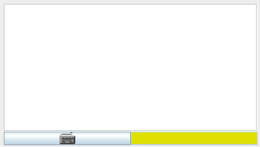
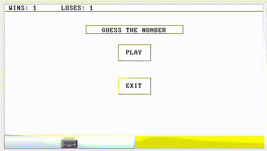

# Guess the number

A game written in the Jack language.

# Gameplay

A user presses the PLAY button.

The user creates a seed for generating a secret number.

The secret number is within the range specified in the NUMBER RANGE box.

The number of attemps to guess the secret number is limited, and the user can see it in the ATTEMPS REMAINED box.

The user tries to guess the secret number by typing a number in the INPUT box.

If the number is less than the secret number, then it's printed in the LESS column.

If the number is greater than the secret number, then it's printed in the GREATER column.

If the number is equal to the secret number, then the VICTORY window is drawn.

If the user runs out of the given attemps, then the GAME OVER window is drawn.

A game can be played multiple times until the EXIT button is pressed.

# Demos

# Makefile commands

Dependencies:
- [the Jack compiler and the vm emulator](https://github.com/itoshkov/nand2tetris-emu/)
- [entr](https://github.com/eradman/entr)

Before using these commands, make sure that you created a [.env file](.env.example).

| Command | Description |
|---------|-------------|
| build   | Compile .jack files in the src directory to the vm directory |
| run     | Run the vm emulator |
| clear   | Remove the vm directory |
| auto_compiler_run | Run a watcher for every .jack file in the src direcotry, which runs the build command after every change | 
